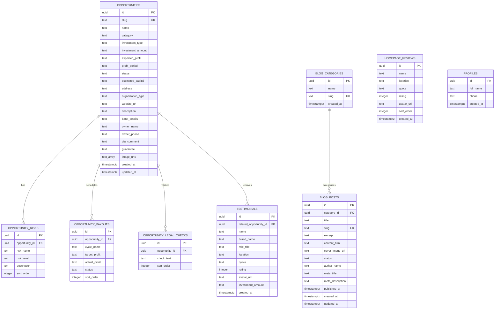

# Biniyog (বিনিয়োগ) - Project Summary & Database Architecture

## 1. Project Overview

**Biniyog (বিনিয়োগ)** is a full-stack, Shariah-compliant (Halal) SME co-investment and crowdfunding web application tailored for Bangladesh. It connects individual and institutional investors with thoroughly vetted small and medium businesses across various sectors including agriculture, manufacturing, retail, healthcare, and technology.

### Core Objectives
- **Shariah Compliance:** Transparent profit-sharing models (Mudarabah, Musharakah, Murabaha) adhering to Islamic financial principles.
- **Transparency & Due Diligence:** Comprehensive business profiles, legal audit checklists, risk factor ratings, and historical payout cycles.
- **Investor Empowerment:** Dual-mode compounding investment calculator (Annual and Monthly) for return forecasting.
- **Content & Education:** Comprehensive blog engine and curated guides on Islamic business investing.
- **High Resiliency:** Server-Side Rendering (SSR) resilient to network and database timeouts via bundled fallback snapshots.

---

## 2. Technology Stack

| Layer | Technology | Purpose & Implementation |
| :--- | :--- | :--- |
| **Framework** | **TanStack Start (React 19)** | Full-stack SSR React framework running on Vite and Nitro server engine. |
| **Routing** | **TanStack Router** | File-based, type-safe client & server routing. |
| **State & Fetching** | **TanStack Query (React Query)** | Server state management, smart caching, and revalidation. |
| **Styling & Design** | **Tailwind CSS v4 + Radix UI** | Modern design system with Radix UI primitives, Lucide icons, Framer Motion, and GSAP micro-animations. |
| **Database & Auth** | **Supabase (PostgreSQL)** | Managed PostgreSQL database with Row Level Security (RLS) and Supabase Auth. |
| **Cloud Storage** | **Supabase Storage** | S3-compatible cloud object storage for project galleries and blog covers. |
| **Rich Text Editor** | **TipTap Editor** | Rich text content authoring with XSS sanitization. |
| **Bot Protection** | **Google reCAPTCHA v2 / v3** | Anti-scraping protection for sensitive project information. |

---

## 3. Database Architecture & Schema

The database is built on PostgreSQL inside Supabase, featuring 7 core relational tables, foreign key constraints with cascade deletes, automated triggers, and Row Level Security (RLS) policies.

### 3.1 Entity-Relationship Diagram (ERD)




---

### 3.2 Detailed Table Specifications

#### 1. `public.opportunities`
Core table representing investment campaigns and business profiles.

| Column | Type | Constraints / Default | Description |
| :--- | :--- | :--- | :--- |
| `id` | `uuid` | `PRIMARY KEY`, default `gen_random_uuid()` | Unique opportunity identifier |
| `slug` | `text` | `UNIQUE`, `NOT NULL` | URL slug identifier |
| `name` | `text` | `NOT NULL` | Campaign / Company title |
| `category` | `text` | `NULL` | Business category (e.g., এগ্রো, গার্মেন্টস, আইটি) |
| `investment_type` | `text` | `NULL` | Contract type (e.g., মুদারাবা, মুশারাকা) |
| `investment_amount` | `text` | `NULL` | Target fund required |
| `expected_profit` | `text` | `NULL` | Projected annual ROI range (e.g., ১৮-২২%) |
| `profit_period` | `text` | `NULL` | Distribution interval (e.g., প্রতি ৩ মাস পর পর) |
| `status` | `text` | Default `'চলমান'` | Funding status (`চলমান`, `শেষের দিকে`, `Fully Funded`) |
| `description` | `text` | `NULL` | Full business description |
| `address` | `text` | `NULL` | Physical business address |
| `organization_type` | `text` | `NULL` | Legal structure (e.g., প্রাইভেট লিমিটেড) |
| `estimated_capital` | `text` | `NULL` | Total business capital |
| `website_url` | `text` | `NULL` | Official website or social page |
| `image_urls` | `text[]` | `NULL` | Array of image URLs for photo gallery |
| `bank_details` | `text` | `NULL` | Sensitive bank info (masked on public views) |
| `owner_name` | `text` | `NULL` | Sensitive owner / contact person |
| `owner_phone` | `text` | `NULL` | Sensitive contact phone number |
| `cfa_comment` | `text` | `NULL` | Financial analyst review note |
| `guarantee` | `text` | `NULL` | Security / collateral details |
| `created_at` | `timestamptz` | `DEFAULT now()`, `NOT NULL` | Record creation timestamp |
| `updated_at` | `timestamptz` | `DEFAULT now()`, `NOT NULL` | Trigger-updated timestamp |

---

#### 2. `public.opportunity_risks`
Risk analysis per investment opportunity.

| Column | Type | Constraints / Default | Description |
| :--- | :--- | :--- | :--- |
| `id` | `uuid` | `PRIMARY KEY`, default `gen_random_uuid()` | Unique risk ID |
| `opportunity_id` | `uuid` | `NOT NULL`, `REFERENCES opportunities(id) ON DELETE CASCADE` | Associated opportunity |
| `risk_name` | `text` | `NOT NULL` | Risk title |
| `risk_level` | `text` | `NOT NULL`, default `'মধ্যম'` | Risk tier: `'নিম্ন'`, `'মধ্যম'`, `'উচ্চ'` |
| `description` | `text` | `NULL` | Mitigation strategy / risk detail |
| `sort_order` | `integer` | Default `0` | Order of presentation |

---

#### 3. `public.opportunity_payouts`
Profit payout cycles and distribution records.

| Column | Type | Constraints / Default | Description |
| :--- | :--- | :--- | :--- |
| `id` | `uuid` | `PRIMARY KEY`, default `gen_random_uuid()` | Unique payout ID |
| `opportunity_id` | `uuid` | `NOT NULL`, `REFERENCES opportunities(id) ON DELETE CASCADE` | Associated opportunity |
| `cycle_name` | `text` | `NOT NULL` | Cycle title (e.g., ১ম কোয়ার্টার - ২০২৩) |
| `target_profit` | `text` | `NULL` | Expected return percentage or amount |
| `actual_profit` | `text` | `NULL` | Actual disbursed return |
| `status` | `text` | `NOT NULL`, default `'পেইড'` | Payout status: `'পেইড'`, `'চলমান'`, `'বাকি'` |
| `sort_order` | `integer` | Default `0` | Order of presentation |

---

#### 4. `public.opportunity_legal_checks`
Verified legal audits and due diligence checkpoints.

| Column | Type | Constraints / Default | Description |
| :--- | :--- | :--- | :--- |
| `id` | `uuid` | `PRIMARY KEY`, default `gen_random_uuid()` | Unique legal check ID |
| `opportunity_id` | `uuid` | `NOT NULL`, `REFERENCES opportunities(id) ON DELETE CASCADE` | Associated opportunity |
| `check_text` | `text` | `NOT NULL` | Verification item (e.g., ট্রেড লাইসেন্স ভেরিফাইড) |
| `sort_order` | `integer` | Default `0` | Order of presentation |

---

#### 5. `public.testimonials`
Investor feedback and verified campaign reviews.

| Column | Type | Constraints / Default | Description |
| :--- | :--- | :--- | :--- |
| `id` | `uuid` | `PRIMARY KEY`, default `gen_random_uuid()` | Unique testimonial ID |
| `name` | `text` | `NOT NULL` | Investor name |
| `brand_name` | `text` | `NULL` | Associated enterprise or venture |
| `related_opportunity_id` | `uuid` | `REFERENCES opportunities(id) ON DELETE SET NULL` | Linked opportunity |
| `role_title` | `text` | `NULL` | Investor designation / profession |
| `location` | `text` | `NULL` | City or region |
| `quote` | `text` | `NOT NULL` | Testimonial statement |
| `rating` | `integer` | `CHECK (rating >= 1 AND rating <= 5)` | Rating (1 to 5 stars) |
| `avatar_url` | `text` | `NULL` | Profile avatar image URL |
| `investment_amount` | `text` | `NULL` | Amount invested by the reviewer |
| `created_at` | `timestamptz` | `DEFAULT now()`, `NOT NULL` | Creation timestamp |

---

#### 6. `public.homepage_reviews`
Curated investor reviews featured on the platform landing page.

| Column | Type | Constraints / Default | Description |
| :--- | :--- | :--- | :--- |
| `id` | `uuid` | `PRIMARY KEY`, default `gen_random_uuid()` | Unique review ID |
| `name` | `text` | `NOT NULL`, default `'বিনিয়োগকারী'` | Reviewer name |
| `location` | `text` | `NULL` | Location / City |
| `quote` | `text` | `NOT NULL` | Review quotation |
| `rating` | `integer` | `CHECK (rating >= 1 AND rating <= 5)` | 1-5 star rating |
| `avatar_url` | `text` | `NULL` | Reviewer avatar image URL |
| `sort_order` | `integer` | `NOT NULL`, default `0` | Landing page display priority |
| `created_at` | `timestamptz` | `DEFAULT now()`, `NOT NULL` | Creation timestamp |

---

#### 7. `public.blog_categories`
Taxonomy categories for educational posts and articles.

| Column | Type | Constraints / Default | Description |
| :--- | :--- | :--- | :--- |
| `id` | `uuid` | `PRIMARY KEY`, default `gen_random_uuid()` | Category UUID |
| `name` | `text` | `NOT NULL` | Category label |
| `slug` | `text` | `UNIQUE`, `NOT NULL` | URL slug |
| `created_at` | `timestamptz` | `DEFAULT now()`, `NOT NULL` | Creation timestamp |

---

#### 8. `public.blog_posts`
Articles, investment guides, and market insights.

| Column | Type | Constraints / Default | Description |
| :--- | :--- | :--- | :--- |
| `id` | `uuid` | `PRIMARY KEY`, default `gen_random_uuid()` | Post UUID |
| `title` | `text` | `NOT NULL` | Article headline |
| `slug` | `text` | `UNIQUE`, `NOT NULL` | SEO slug |
| `excerpt` | `text` | `NULL` | Summary for preview cards |
| `content_html` | `text` | `NOT NULL` | Full rich text content (TipTap HTML) |
| `cover_image_url` | `text` | `NULL` | Hero banner image URL |
| `category_id` | `uuid` | `REFERENCES blog_categories(id) ON DELETE SET NULL` | Linked category |
| `status` | `text` | `NOT NULL`, default `'draft'`, `CHECK in ('draft', 'published')` | Publishing state |
| `author_name` | `text` | `NULL` | Author name |
| `meta_title` | `text` | `NULL` | SEO meta title |
| `meta_description` | `text` | `NULL` | SEO meta description |
| `published_at` | `timestamptz` | `NULL` | Publication timestamp |
| `created_at` | `timestamptz` | `DEFAULT now()`, `NOT NULL` | Creation timestamp |
| `updated_at` | `timestamptz` | `DEFAULT now()`, `NOT NULL` | Trigger-updated timestamp |

---

#### 9. `public.profiles`
User profiles synced with Supabase Auth (`auth.users`) for registered investors.

| Column | Type | Constraints / Default | Description |
| :--- | :--- | :--- | :--- |
| `id` | `uuid` | `PRIMARY KEY`, `REFERENCES auth.users(id) ON DELETE CASCADE` | User UUID |
| `full_name` | `text` | `NULL` | User's full name |
| `phone` | `text` | `NULL` | User's phone number |
| `created_at` | `timestamptz` | `DEFAULT now()`, `NOT NULL` | Registration timestamp |

---

### 3.3 Database Triggers & Functions

#### Auto Update `updated_at`
```sql
create or replace function public.handle_updated_at()
returns trigger as $$
begin
  new.updated_at = now();
  return new;
end;
$$ language plpgsql;

create trigger set_opportunities_updated_at
  before update on public.opportunities
  for each row execute function public.handle_updated_at();

create trigger set_blog_posts_updated_at
  before update on public.blog_posts
  for each row execute function public.handle_updated_at();
```

---

### 3.4 Storage Buckets & Policies

1. **`opportunity-images`**:
   - Stores project hero banners, logos, and factory/farm pictures.
   - **Policies:** Public `SELECT` for all users; `INSERT`, `UPDATE`, `DELETE` restricted to authenticated admins.
2. **`blog-images`**:
   - Stores rich text inline images and blog article cover banners.
   - **Policies:** Public `SELECT` for all users; `INSERT`, `UPDATE`, `DELETE` restricted to authenticated admins.

---

### 3.5 Security & Row Level Security (RLS) Model

- **Public (Anonymous) Access:**
  - `opportunities`, `opportunity_risks`, `opportunity_payouts`, `opportunity_legal_checks`, `testimonials`, `homepage_reviews`, and `blog_categories` allow unrestricted public `SELECT`.
  - `blog_posts` permits public `SELECT` strictly when `status = 'published'`.
- **Admin (Authenticated) Access:**
  - Full CRUD (`SELECT`, `INSERT`, `UPDATE`, `DELETE`) across all database tables is granted exclusively to authenticated users (`auth.role() = 'authenticated'`).
- **Sensitive Data Isolation:**
  - Direct founder contact information and sensitive bank details are masked from direct public tables and served only via the server-side API `/api/public/reveal-details` after Google reCAPTCHA verification.

---

## 4. Key Application Systems

### 1. Investment Calculator
- **Location:** `src/components/InvestmentCalculator.tsx`
- **Formulas:**
  - **Yearly Mode:** Annual compounding:
    $$\text{Total Return} = \text{Amount} \times (1 + \text{ROI})^{\text{Years}} - \text{Amount}$$
  - **Monthly Mode:** Monthly compounding with derived effective annual profit:
    $$\text{Monthly Rate} = \frac{\text{ROI}}{12}, \quad \text{Total Return} = \text{Amount} \times (1 + \text{Monthly Rate})^{\text{Months}} - \text{Amount}$$

### 2. High-Availability SSR Fallback
- **Location:** `src/lib/projects.ts`, `src/lib/homepage_reviews.ts`
- **Implementation:** Queries to Supabase race against a strict 4,000ms timeout. If a network blip occurs, the server automatically resolves using bundled snapshot data (`opportunities-fallback.json`, `testimonials-fallback.json`, `homepage-reviews-fallback.json`), guaranteeing zero page downtime.

### 3. Admin Control Suite
- **Location:** `src/routes/admin/dashboard.tsx`
- **Features:** Complete portal for editing opportunity parameters, uploading media to Supabase storage, managing risk tags, scheduling payout histories, reviewing testimonials, and writing TipTap blog articles.

---

## 5. Application Route Structure

```
src/routes/
├── __root.tsx                           # Global layout & metadata
├── index.tsx                            # Landing page & calculator
├── login.tsx                            # User login & redirect handler
├── register.tsx                         # User registration (profiles table sync)
├── logout.tsx                           # Session sign-out handler
├── opportunities.index.tsx              # All opportunities directory
├── opportunities.$id.tsx                # Opportunity profile & due diligence
├── blog.index.tsx                       # Blog listing & categories
├── blog.$slug.tsx                       # Single blog post article
├── reviews.tsx                          # Testimonials & community reviews
├── insights/                            # Educational guides & articles
│   ├── index.tsx
│   ├── $slug.tsx
│   ├── inflation-portfolio.tsx
│   ├── keno-somriddhite-biniyog.tsx
│   ├── krishi-khate-biniyog.tsx
│   └── sme-halal-biniyog.tsx
├── admin/                               # Admin portal
│   ├── index.tsx
│   ├── login.tsx
│   ├── dashboard.tsx
│   ├── dashboard_.blog.new.tsx
│   └── dashboard_.blog.$postId.edit.tsx
└── api/
    └── public/
        └── reveal-details.ts            # Protected contact reveal endpoint
```

